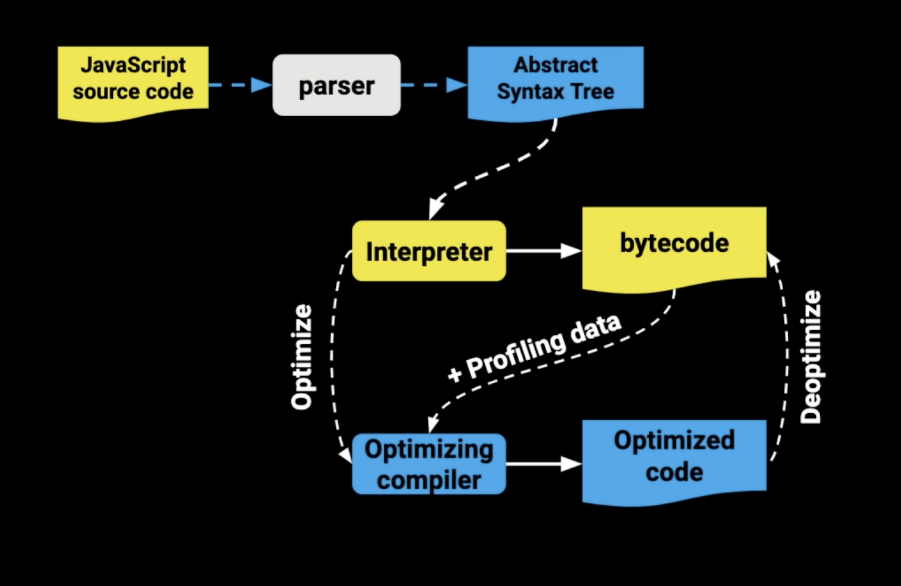
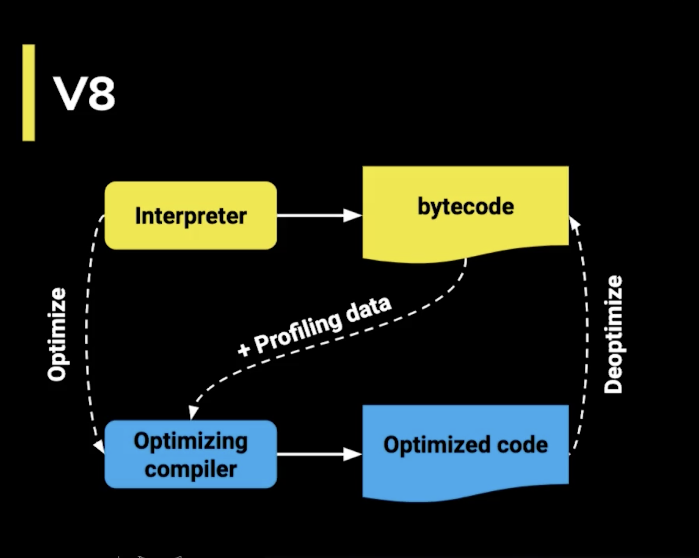
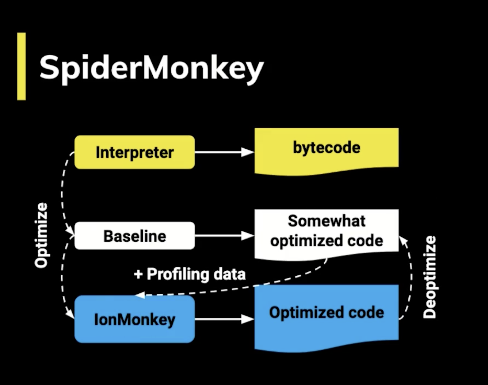
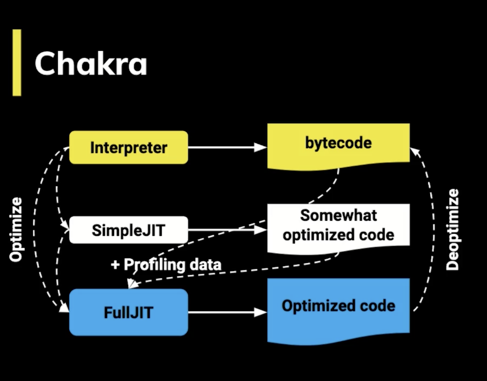
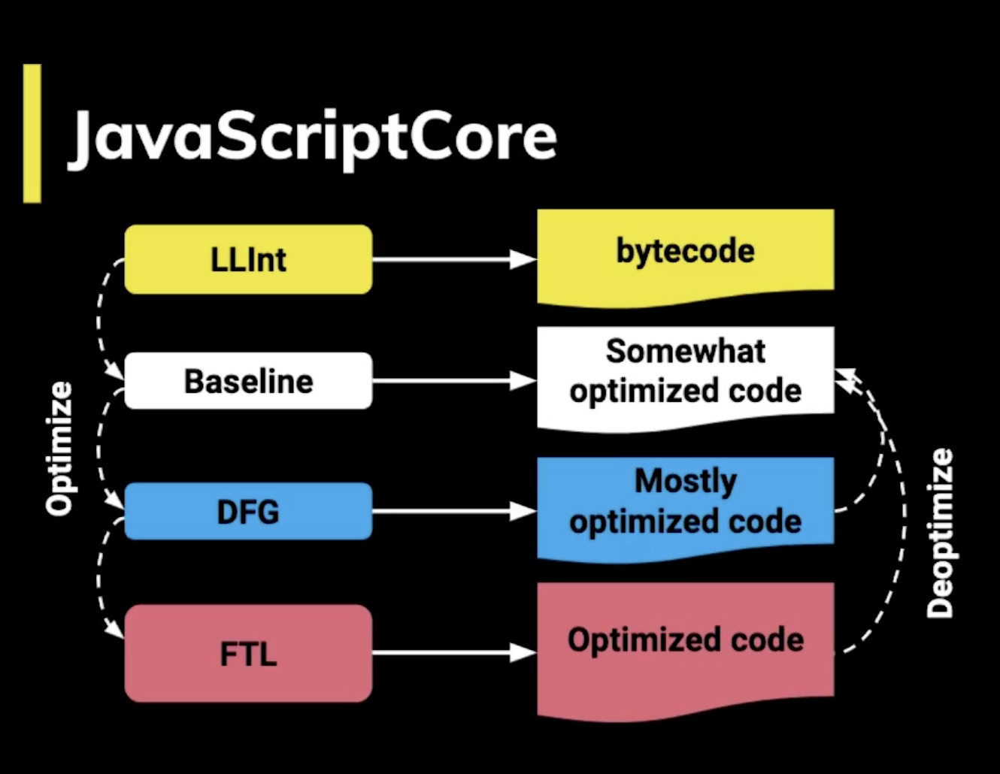
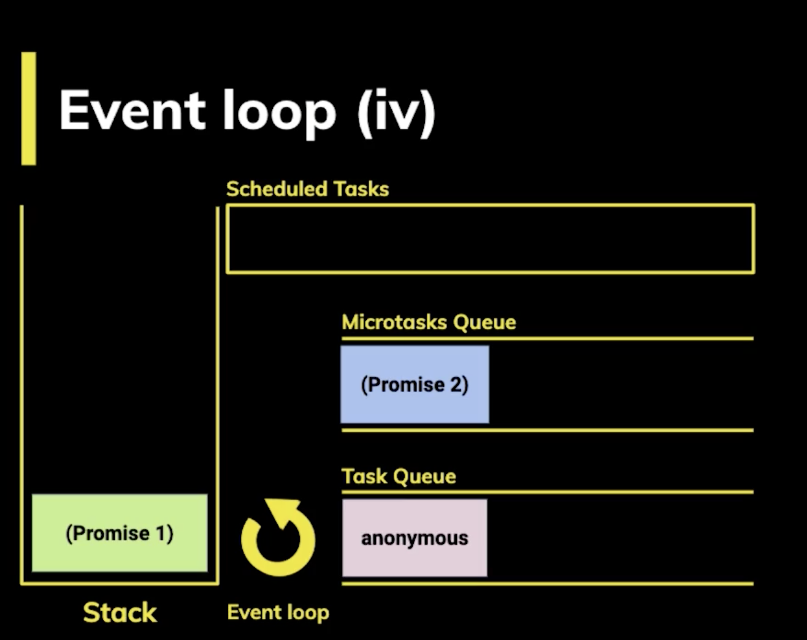

# javascript_project
DOM operation. Creation of plugins that give more functionality to the video player. Implementation of events in an object according to the needs of the project

# Project start
## Install live server
```terminal
$ npm i -D live-server
```

# How a script reaches the browser
The **DOM** is the browser representation of an HTML document.

The browser interprets the HTML file and when it finishes transforming it into the DOM, the DOMContentLoaded event is fired, which means that the entire document is available for manipulation.

Every script that we load on our page has a call and an execution.

Both with async and defer we can make asynchronous calls but it has its differences:
* **async**: With async we can make the request asynchronously and we are not going to stop loading the DOM until the code is executed.
* **defer**: The request is the same asynchronous as in the async but it will defer the execution of the Javascript until the end of the whole document loading.

Keep in mind that when you load a page and a script is found to execute, the whole load stops. That is why it is recommended to add your scripts just before closing the body so that the entire document is available.

# Scope
The scope is what defines the lifetime of a variable, in which parts of our code can be used.

## Global scope
Variables available globally, the word var is used, they are accessible by all the scripts that are loaded on the page. There is a lot of risk of overwriting here.

## Function Scope
Variables declared within a function only visible within itself (including the arguments passed to the function).

## Block Scope
Variables defined within a block, for example variables declared within a while or for loop. Let and const are used to declare these types of variables.

## Module Scope
When a script of type module is denoted with the attribute type = "module the variables are limited to the file in which they are declared.

# Closures
They are functions that return a function or an object with functions that keep the variables that were declared out of scope.

Closures serve to have something similar to private variables, a feature that does not have JavaScript by default. In other words, they encapsulate variables that cannot be directly modified by other objects, only by functions belonging to it.

# This
this refers to an object, that object is the one currently running a piece of code.

You cannot assign a value to this directly and it depends on what scope we are in:
* When we call this in the **Global Scope or Function Scope**, the window object is referenced. Except when we are in strict mode it will return undefined.
* When we call this from **a function** that is contained in an object, this refers to that object.
* When we call this from a **"class"**, the instance generated by the constructor is referenced. 

# Call, apply and bind methods
These functions serve to establish the value of this, that is, to change the context that will be used when the function is called.

The call, apply and bind functions are part of the Function prototype. Every function uses this prototype and therefore has these three functions.

* **functionName.call()**. Execute the function receiving the this as the first argument and the following are the arguments received by the function that called the call.
* **functionName.apply()**. Executes the function receiving this as the first argument and an array with the arguments that the function that called apply receives as the second argument.
* **functionName.bind()**. It receives this as the first and only argument. It doesn't execute the function, it just returns another function with the new built-in this.

# Prototype
In Javascript everything is objects, we don't have classes, we don't have that plane to create objects.

All objects "inherit" from one prototype, which in turn inherits from another prototype, and so on, creating what is called the prototype chain.

The keyword new creates a new object that "inherits" all the properties of the prototype from another object. Do not confuse prototype with proto which is just a property on each instance that points to the prototype it inherits from.

# Prototypal inheritance
By default the objects in JavaScript have as prototype Object which is the starting point of all objects, it is the parent prototype. Object is the root of everything, therefore it has an undefined parent prototype.

When a function or variable that is not in the same object that called it is called, the entire prototype chain is searched until it is found or returns undefined.

The hasOwnProperty function is used to verify if a property is part of the object or if it is inherited from its prototype chain.

# Parsers and the Abstract Syntax Tree
The JS Engine receives the source code and processes it as follows:
* The **parser** breaks down and creates tokens that make up the AST.
* It's compiled to **bytecode** and executed.
* Whatever is possible is **optimized to machine code** and the base code is replaced.

A **SyntaxError** is launched when the JavaScript engine finds parts that are not part of the language syntax and this is achieved thanks to the fact that it has an AST generated by the parser.

The parser is 15% to 20% of the execution process, so you have to use the code's parser just when we need it and not before knowing if it will be used or not.


Links:
* https://esprima.org/
* https://astexplorer.net/

# How does the JavaScript Engine work?
What does a JS Engine do?
* Receive source code.
* Parse the code and produce an Abstract Syntax Tree (AST).
* Compiled to bytecode and executed.
* Machine code is optimized and base code is replaced.

Once we have the AST, now we have to convert it to Bytecode.

**Bytecode** is like the assembler code but instead of operating on the processor it operates on the V8 virtual machine of the browser.

**Machine code** is the lowest level, it is binary code that goes directly to the processor.

**The profiler** is located between the bytecode and the optimizer

Each virtual machine has its peculiarities, for example V8 has something called Hot Functions.

When a function statement is executed very frequently, V8 calls it a hot function and performs an optimization that consists of converting it to machine code so that it does not have to be interpreted again and speed up its execution.

Each browser has its JavaScript Engine implementation:
* SpiderMonkey - Firefox
* Chackra - Edge
* JavaScriptCore - Safari
* V8 - Chrome

## V8 Engine - Chrome


## SpiderMonkey - Firefox


## Chacra - Edge


## JavaScriptCore - Safari


# Event Loop
The Event Loop makes Javascript appear to be multithreading even though it runs in a single process.

Javascript is organized using the following data structures:
* **Stack**. Stack in an organized way the different instructions that are called. Thus, it has a trace of where the program is, where we are at.
* **Memory Heap**. In a disorganized way, information on variables and scope is stored.
* **Schedule Tasks**. Here, tasks scheduled for execution are added to the queue.
* **Task Queue**. Here are added the tasks that are already ready to go to the stack and be executed. The stack must be empty for this to happen.
* **MicroTask Queue**. Here the promises are added. This Queue is the one with the highest priority.

The Event Loop is a loop that is running all the time and periodically goes through checking queues and the stack moving tasks between these two structures.



# Promises
To create the promises we use the Promise class. The Promise constructor receives a single argument, a two parameter callback, resolve and reject. resolve is the function to execute when it is resolved and reject when it is rejected.

The asynchronous / wait is just sugar syntax of a promise, below is exactly the same.

The Promise class has some pretty useful static methods:
* **Promise.all.** It gives error if one of the promises is rejected.
* **Promise.race.** Return only the promise that is resolved first.

# Getters and setters
Getters and setters are functions that we can use in an object to have virtual properties. The keywords set and get are used to create these properties.

These properties, being functions, can carry a validation through and be used with the assignment operator as if they were just another variable inside the object.

# Proxy
## Links
* https://developer.mozilla.org/es/docs/Web/JavaScript/Referencia/Objetos_globales/Proxy
* https://github.com/hiddentao/fast-levenshtein

The proxy serves to intercept the reading of properties of an object (the get, and set) among many other functions. Thus, before the call reaches the object, we can manipulate it with a logic that we define.